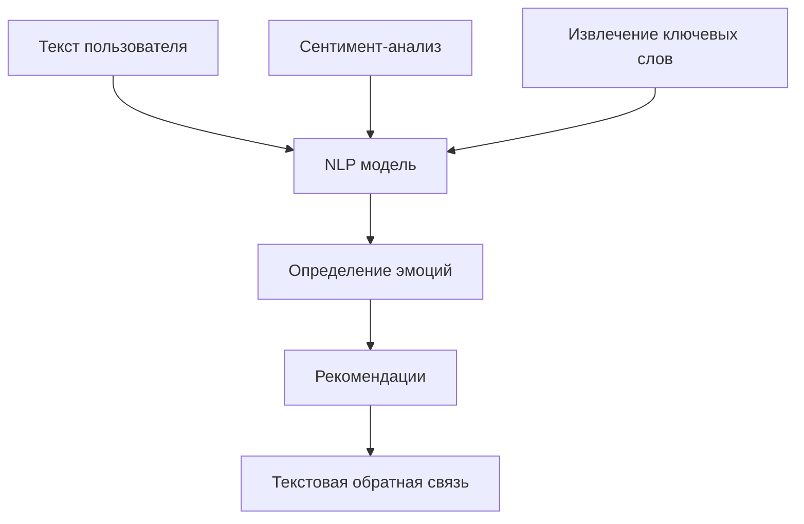
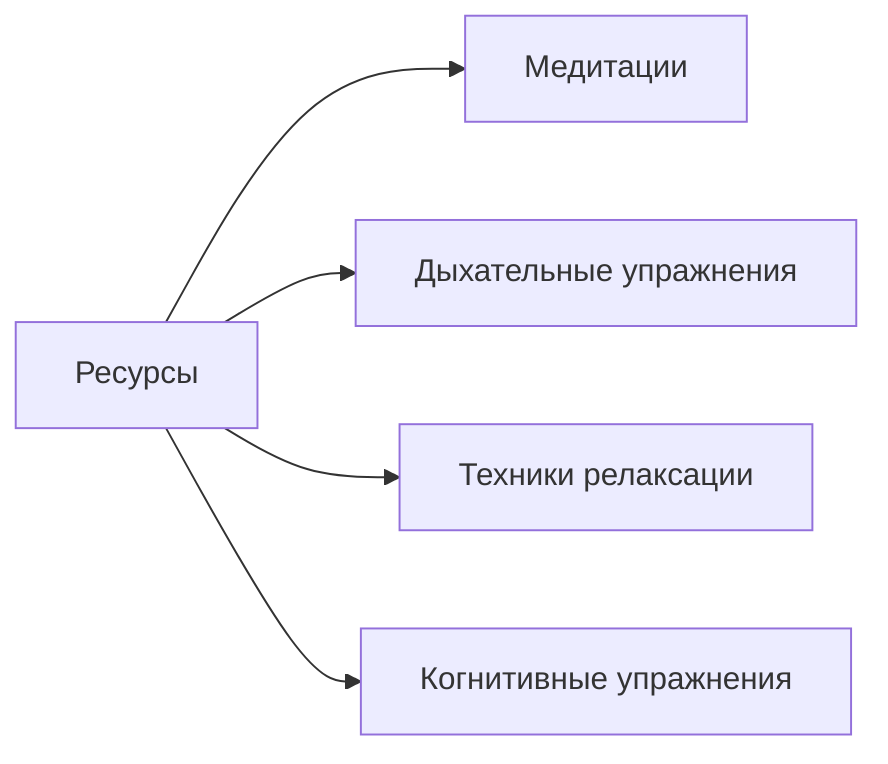

# EmoTrack - План развития и улучшений

## 📊 Анализ текущего состояния

### Что уже реализовано:

- ✅ Система аутентификации (регистрация, вход, JWT токены)
- ✅ Ролевая система (психолог / пациент)
- ✅ Отслеживание эмоций (интенсивность 1-10, заметки)
- ✅ WebSocket чат между психологом и пациентом
- ✅ Сессии с календарём и доступностью
- ✅ Библиотека ресурсов (файлы, PDF, медиа)
- ✅ Уведомления (модель в БД)
- ✅ Голосовые заметки (VoiceRecorder)
- ✅ Аналитика для психолога (графики, тренды)
- ✅ Glassmorphism UI дизайн
- ✅ Docker развёртывание

### Технический стек:

- **Backend:** FastAPI + PostgreSQL + SQLAlchemy + WebSocket
- **Frontend:** React + Tailwind CSS + Recharts + Lucide Icons
- **DevOps:** Docker + Nginx

---

## 🚀 Предлагаемые улучшения и новые функции

### 1. AI/Машинное обучение

#### 1.1 Анализ эмоций на основе текста (NLP)



- Интеграция с Hugging Face Transformers или локальной моделью
- Анализ текстовых заметок для автоматического определения эмоций
- Генерация рекомендаций на основе контента

#### 1.2 Прогнозирование настроения

- ML модель для предсказания тренда настроения на неделю
- Раннее предупреждение о потенциальных проблемах
- Персонализированные рекомендации

#### 1.3 AI-ассистент для психологов

- Автоматическое составление отчётов по пациенту
- Выявление паттернов в данных
- Генерация идей для терапевтических техник

---

### 2. Геймификация и мотивация

#### 2.1 Система достижений

| Достижение         | Условие                    | Награда |
| ------------------ | -------------------------- | ------- |
| 🌱 Новичок         | 1-я запись эмоций          | Бейдж   |
| 📅 Неделя streak   | 7 дней подряд              | Бейдж   |
| 💝 Откровенность   | 50 записей с заметками     | Бейдж   |
| 🎯 Цель достигнута | Достижение цели настроения | Бейдж   |
| 👥 Социальный      | 10 сообщений психологу     | Бейдж   |

#### 2.2 Ежедневные цели

- Целевое количество записей эмоций в день
- Минимальный уровень настроения для поддержания
- Награды за достижение целей

#### 2.3 Отслеживание streak

```javascript
// Пример структуры данных
{
  currentStreak: 7,
  longestStreak: 21,
  lastEntryDate: "2026-02-02",
  weeklyGoals: {
    entriesTarget: 14,
    currentEntries: 10
  }
}
```

---

### 3. Уведомления и напоминания

#### 3.1 Push-уведомления

- Web Push API для браузера
- Напоминания о записи эмоций
- Уведомления о новых сообщениях
- Напоминания о сессиях за 30 мин

#### 3.2 Email-уведомления

- Еженедельный дайджест (статистика, тренды)
- Уведомления о пропущенных сессиях
- Напоминания о целях

#### 3.3 Настраиваемые напоминания

- Время для ежедневного check-in
- Частота напоминаний
- Типы уведомлений (вкл/выкл)

---

### 4. Социальные функции

#### 4.1 Сообщества поддержки

- Тематические группы (тревожность, депрессия, стресс)
- Модерация психологами
- Анонимное участие

#### 4.2 Sharing (опционально)

- Экспорт графиков настроения
- Анонимная статистика для исследований

---

### 5. Улучшения UI/UX

#### 5.1 Тёмная/светлая тема

```javascript
// Контекст темы
const ThemeContext = {
	theme: 'dark', // или 'light' или 'system'
	toggle: () => setTheme(prev => (prev === 'dark' ? 'light' : 'dark')),
	colors: {
		dark: { background: '#1a1a2e', primary: '#8b5cf6' },
		light: { background: '#f5f5f5', primary: '#6d28d9' },
	},
}
```

#### 5.2 Мобильная адаптация

- Mobile-first подход для всех страниц
- Bottom navigation для мобильных
- Touch-friendly компоненты

#### 5.3 Анимации и микровзаимодействия

- Framer Motion для анимаций
- Успешные состояния (confetti, checkmarks)
- Loading states и skeleton screens

#### 5.4 Accessibility

- ARIA labels
- Keyboard navigation
- Screen reader support
- Color contrast compliance

---

### 6. Интеграции

#### 6.1 Календарные интеграции

- Google Calendar sync
- Outlook Calendar sync
- ICS export/import

#### 6.2 Носимые устройства

- Apple HealthKit интеграция
- Google Fit API
- Автоматический импорт данных о сне и активности

#### 6.3 API для разработчиков

- Документация (Swagger/ReDoc)
- Rate limiting
- API versioning
- Webhooks

---

### 7. Безопасность

#### 7.1 Двухфакторная аутентификация (2FA)

- TOTP через Google Authenticator
- SMS коды
- Backup codes

#### 7.2 Шифрование данных

- End-to-end шифрование сообщений
- Шифрование чувствительных данных в БД

#### 7.3 Audit Log

```python
# Модель для аудита
class AuditLog(Base):
    id = Column(Integer, primary_key=True)
    user_id = Column(Integer, ForeignKey('users.id'))
    action = Column(String)  # login, view_data, export, etc.
    ip_address = Column(String)
    user_agent = Column(String)
    timestamp = Column(DateTime, default=datetime.utcnow)
```

#### 7.4 GDPR compliance

- Data export (право на экспорт данных)
- Data deletion (право на удаление)
- Privacy settings

---

### 8. Аналитика и отчёты

#### 8.1 Расширенная аналитика для пациента

- Месячные/годовые тренды
- Сезонные паттерны
- Корреляции (погода ↔ настроение)

#### 8.2 PDF/Excel экспорт

- Генерация отчётов
- Графики в PDF
- Таблицы данных в Excel

#### 8.3 Сравнительная аналитика

- Сравнение недель/месяцев
- Benchmark анонимизированный
- Персональные цели

---

### 9. Улучшения функционала

#### 9.1 Расширенное отслеживание эмоций

- Многоуровневая классификация эмоций
  - Базовые (радость, грусть, гнев, страх, удивление, отвращение)
  - Комплексные (тревога, апатия, эмоциональное выгорание)
- Контекст (события, триггеры)
- Теги и категории

#### 9.2 Улучшенный голосовой ввод

- Whisper API для транскрибации
- Автоматическое определение эмоций по голосу
- Тональный анализ

#### 9.3 Медитации и упражнения



#### 9.4 Journal prompts

- Ежедневные вопросы для размышления
- Психологические техники в формате диалога
- Writing prompts для терапии

---

### 10. Технические улучшения

#### 10.1 Кэширование

- Redis для сессий и кэша
- CDN для статических файлов
- Query optimization

#### 10.2 Тестирование

- Unit tests (pytest)
- Integration tests
- E2E tests (Playwright/Cypress)
- Test coverage reporting

#### 10.3 CI/CD

- GitHub Actions/GitLab CI
- Автоматические тесты
- Автоматический деплой
- Rollback механизм

#### 10.4 Мониторинг

- Prometheus + Grafana
- Error tracking (Sentry)
- Performance monitoring
- Логирование

---

## 📋 Приоритет задач

### Высокий приоритет (MVP+)

1. Push-уведомления
2. Тёмная/светлая тема
3. 2FA аутентификация
4. Расширенное отслеживание эмоций
5. Мобильная адаптация

### Средний приоритет

1. Система достижений
2. Email-уведомления
3. Интеграция с календарём
4. PDF экспорт отчётов
5. AI-анализ текста

### Низкий приоритет

1. Сообщества поддержки
2. Интеграция с носит. устройствами
3. Публичное API
4. GDPR compliance

---

## 🗓️ Roadmap

### Версия 1.1 (1-2 месяца)

- [ ] Push-уведомления
- [ ] Тёмная тема
- [ ] Улучшенное отслеживание эмоций
- [ ] Мобильная адаптация
- [ ] Accessibility

### Версия 1.2 (2-3 месяца)

- [ ] Система достижений
- [ ] Email-дайджест
- [ ] AI-анализ заметок
- [ ] Календарные интеграции
- [ ] 2FA

### Версия 1.3 (3-4 месяца)

- [ ] Медитации и упражнения
- [ ] Экспорт отчётов (PDF)
- [ ] Интеграция с носим. устройствами
- [ ] Audit log

### Версия 2.0 (6+ месяцев)

- [ ] AI-прогнозирование
- [ ] Публичное API
- [ ] Корпоративная версия
- [ ] Белый лейбл
- [ ] GDPR compliance

---

## 💡 Дополнительные идеи

### B2B решения

- Корпоративное wellness tracking
- Employee assistance program (EAP)
- Team analytics для менеджеров

### Образовательные функции

- Курсы по психологической грамотности
- Тесты самооценки
- Библиотека статей

### Комьюнити

- Форум для пациентов
- Peer support groups
- Mentorship программа

---

## 🔧 Технический долг

1. **Удалить дублирующиеся роуты** в App.jsx (строки 34-93)
2. **Улучшить типизацию** (TypeScript полностью)
3. **Добавить error boundaries** в React
4. **Оптимизировать WebSocket** (переподключение, heartbeats)
5. **Добавить rate limiting** на API
6. **Улучшить валидацию** данных
7. **Добавить unit tests** для критичных функций
8. **Документировать API** (OpenAPI)
9. **Улучшить логирование**
10. **Настроить CI/CD pipeline**

---

_Документ создан: 2026-02-02_
_Автор: AI Assistant_
